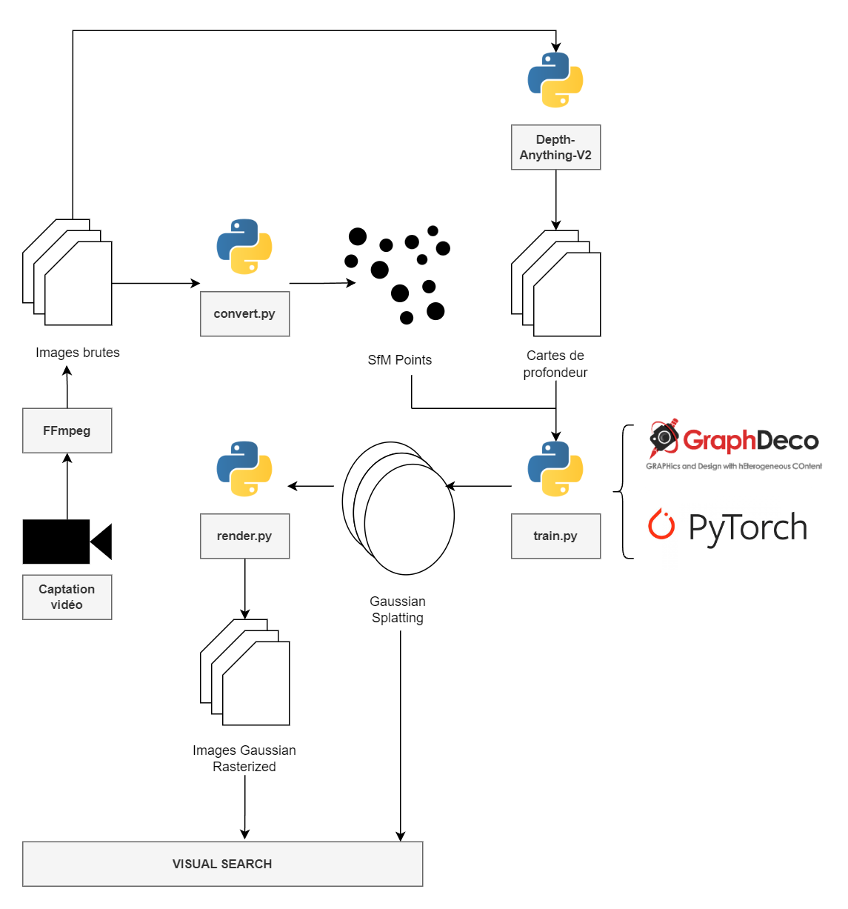

# Computer Vision Project

## Visual Search - Training Gaussian Splatting Workflow

Entraînement de Gaussian Splatting et production de Gaussian Rasterized Images à partir d'une captation vidéo avec
pré-traîtement des images et exploitation automatisée des cartes de profondeur.

### Dépendances

Ce projet nécessite l'installation de plusieurs dépôts GitHub.

- Depth Anything V2 (https://depth-anything-v2.github.io)
- 3D Gaussian Splatting for Real-Time Radiance Field
  Rendering (https://repo-sam.inria.fr/fungraph/3d-gaussian-splatting)

Ce projet nécessite l'installation de logiels ou d'outils tiers.

- FFmpeg (https://ffmpeg.org/download.html)

### Workflow

Le Workflow proposé est le suivant :

**Entrée** : Un média vidéo au format `.mov` ou `.mp4`.

**Sortie** : Un dataset contenant les Gaussian Splatting issues d'un entraînement sur le média d'entrée. La sortie peut
typiquement être exploitée comme point d'entrée d'algorithmes de recherche visuelle.

**Procédure** :



1. Construction d'un échantillon d'images issues de la captation vidéo via `FFmpeg`.
2. Conversion des images brutes en `SfM Points`.
3. Construction des cartes de profondeur des images brutes via le sous framework `DepthAnythingV2`.
4. Entraînement des Gaussian Splatting à partir des `SfM Points` et des cartes de profondeur avec les moteurs
   `GraphDeco` et `PyTorch`.
5. Rendu des Gaussian Splatting pour produire les `Rasterized Gaussian Images` associées.

### Tutoriel

#### Exécution du Workflow

1. Initialiser et installer les dépôts et les sous-dépôts GitHub.
2. Installer les dépendances Python : `pip install -r requirements.txt`.
3. Exécuter le script à la racine du projet :

```bash
python3 workflow.py
```

#### Paramétrage

Le script nécessite la création d'un fichier d'environnement `.env` dont les variables configurables sont les
suivantes :

| Clé                | Description                                                             | Requise | Exemple de valeur |
|--------------------|-------------------------------------------------------------------------|---------|-------------------|
| `PROJECT_NAME`     | Nom du projet                                                           | Oui     | `Default`         |
| `VIDEO_INPUT_PATH` | Chemin du média d'entrée                                                | Oui     | `./input.mov`     |
| `ITERATIONS`       | Nombre d'itérations lors de l'entraînement des Gaussian Splatting       | Non     | `10000`           |
| `CONVERT_SIZE`     | Harmonisation de la taille des images d'entrée                          | Non     | `true`            |
| `FPS`              | Nombre d'images prises par seconde lors de la création de l'échantillon | Non     | `2`               |

#### Sortie

Les Gaussian Splatting produites sont stockées dans le répertoire
`./gaussian-splatting/Data/{PROJECT_NAME}/output/point_cloud/iteration_{ITERATIONS}/point_cloud.ply`
